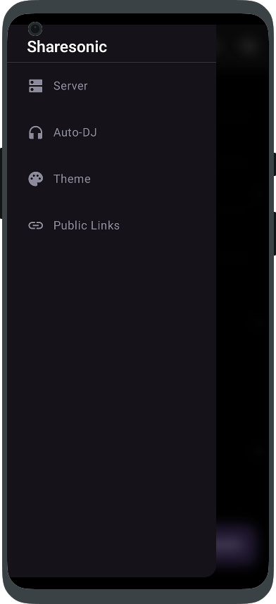
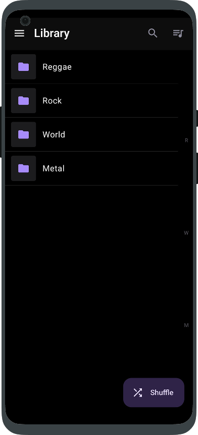
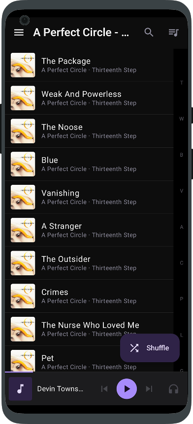
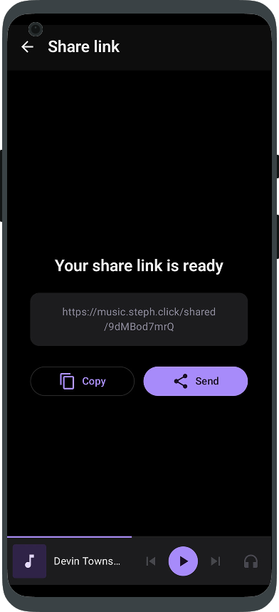
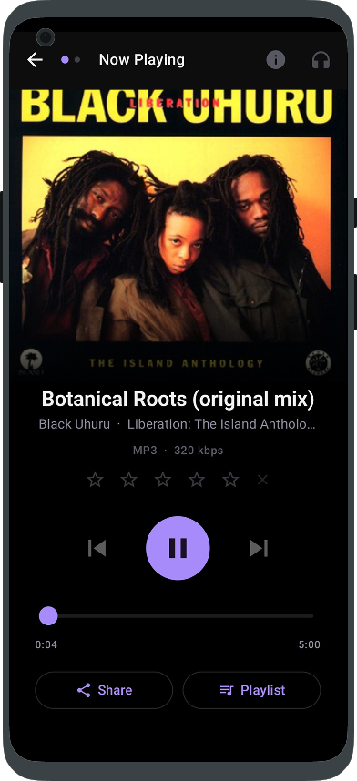
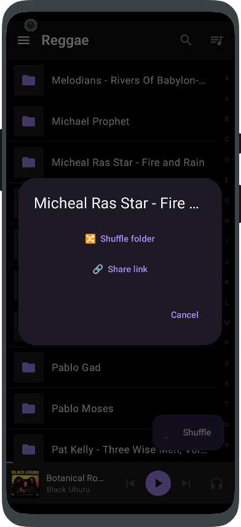
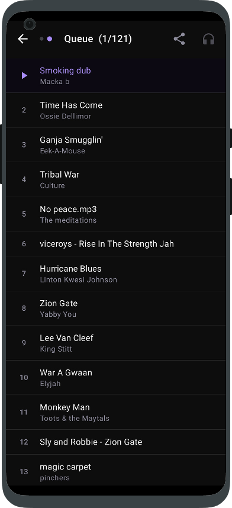

<p align="center">
  
</p>

# Sharesonic

> *Rediscover your music library. One shuffle at a time. Share what you find.*

Sharesonic is an Android client for **[mStream Velvet](https://github.com/aroundmyroom/mStream)** — the self-hosted music server. It is built around a single philosophy: **your music collection is too large to listen to linearly — let chance guide you, then share what surprises you.**

---

## Download

[](https://github.com/Tiritibambix/Sharesonic/releases/latest)

Download the latest APK directly from the [Releases](https://github.com/Tiritibambix/Sharesonic/releases/latest) page.

### Auto-updates with Obtainium

[Obtainium](https://github.com/ImranR98/Obtainium) installs Sharesonic from GitHub Releases and keeps it up to date automatically.

<a href="https://apps.obtainium.imranr.dev/redirect.html?r=obtainium://add/https://github.com/Tiritibambix/Sharesonic"></a>

---

## Why Sharesonic?

Most music apps are built around curation: playlists you already know, albums you already love, artists you already follow. That works fine for a library of a few hundred tracks. It breaks down when you self-host thousands of albums accumulated over years.

Sharesonic is built for the other scenario — the large, chaotic, lovingly disorganised self-hosted library where the best discoveries happen by accident.

- **Shuffle a whole library** — hit shuffle at the root level and let random tracks from your entire collection play back-to-back. You will hear things you forgot you had.
- **Shuffle a folder** — narrow the randomness to a genre, a decade, an artist. Still surprising, still exploratory, with a little more context.
- **Browse by folder** — the folder tree is the primary navigation mode. Your directory structure, exactly as you organised it on the server.
- **Share what you find** — when shuffle surfaces something worth passing on, one tap generates a public share link and opens the Android share sheet. Send it to anyone.

---

## Features

| Feature | Details |
|---|---|
| **Folder browsing** | Navigate your full directory tree from root to individual tracks |
| **Shuffle library** | Server-side random pick via native Velvet API — 30 tracks, no repeats |
| **Shuffle folder** | Shuffle every track under any sub-directory. Gathered server-side (recursive scan + batch metadata) so it scales to huge folders; very large folders (100k+ tracks) are randomly sampled down to 5000 |
| **Auto-DJ** | Continuous smart queue: BPM continuity, harmonic mixing (Camelot wheel), similar artists, artist cooldown, genre filter, crossfade — toggle the headphones icon in the mini player or Now Playing |
| **Share link on track** | Native mStream share API → public `server/shared/XXXXXXXXXX` URL → Android share sheet |
| **Share link on folder** | Long-press any folder → recursively collects every track inside it (including subfolders) and generates a single public link for the whole folder |
| **Share queue** | Generate one public link for the *entire current queue* in a single tap, straight from the queue view |
| **Manage shared links** | "Public Links" screen (drawer) lists every link you've created with its song count and expiry — copy, open, or revoke each one |
| **Star ratings** | Rate the current track 0–5 stars from Now Playing — synced live to mStream's native rating, with an explicit one-tap way back to "unrated" |
| **Now Playing** | Airy, uncluttered full-screen player: cover art, seek bar with elapsed/total time, artist · album info, format/bitrate, ratings and a tap-to-reveal file-details dialog (filename + full path, selectable for copying) — nothing requires scrolling |
| **Add to queue** | Swipe left on any track in the browser |
| **Add to playlist** | Swipe right on a track in the browser, or tap "Playlist" in Now Playing |
| **Playlist management** | Create, rename, delete playlists; add/remove tracks; play all or shuffle |
| **Search** | Pill-shaped, Material You search bar with full-text search grouped into Folders, Artists, Albums and Songs. Tapping a folder navigates straight to it; tapping an artist opens a list of that artist's tracks (featuring/variant spellings included) |
| **Scrobbling** | Playback reported to mStream → forwarded to Last.fm + ListenBrainz (no API keys needed). Requires **"Scrobble from External Apps"** to be enabled in mStream Velvet's server settings — otherwise mStream silently ignores the scrobble calls |

---

## Screenshots

<div align="center">
  <table>
    <tr>
      <td align="center"><br/>Menu</td>
      <td align="center"><br/>Library</td>
      <td align="center"><br/>Album</td>
      <td align="center"><br/>Public Share</td>
    </tr>
    <tr>
      <td align="center"><br/>Player</td>
      <td align="center"><br/>Options on Folder</td>
      <td align="center"><br/>Queue</td>
      <td></td>
    </tr>
  </table>
</div>

---

## Server compatibility

Sharesonic is built for **[mStream Velvet](https://github.com/aroundmyroom/mStream)** (7.5.x). It uses mStream Velvet's native API for everything: browsing, streaming, sharing, shuffle, Auto-DJ, playlist management, and search. The Subsonic compatibility layer is now only a dormant legacy fallback.

Generic Subsonic servers (Navidrome, Airsonic, etc.) are not supported yet — planned for a future release.

---

## Installation

### Direct download

1. Download the latest APK from [Releases](https://github.com/Tiritibambix/Sharesonic/releases/latest)
2. On your Android device: **Settings → Security → Install unknown apps** → allow your browser or file manager
3. Open the downloaded APK and install
4. Launch Sharesonic, enter your mStream server URL, username and password, tap **Test** then **Save**

### Obtainium (recommended — auto-updates)

1. Install [Obtainium](https://github.com/ImranR98/Obtainium)
2. Tap the badge below or add `https://github.com/Tiritibambix/Sharesonic` manually

<a href="https://apps.obtainium.imranr.dev/redirect.html?r=obtainium://add/https://github.com/Tiritibambix/Sharesonic"></a>

---

## Building from source

### Prerequisites

- JDK 17
- Android SDK with build tools for API 35
- A `local.properties` file at the project root with your SDK path:

```properties
sdk.dir=/path/to/your/Android/Sdk
```

### Debug build

```bash
./gradlew assembleDebug
# APK: app/build/outputs/apk/debug/app-debug.apk
```

### Release build

```bash
./gradlew assembleRelease
# APK: app/build/outputs/apk/release/app-release-unsigned.apk
```

---

## CI / CD

GitHub Actions runs on every push and tag:

| Trigger | Action |
|---|---|
| Push to `main` | Build debug APK, upload as workflow artifact |
| Tag `v*` | Build release APK, create GitHub Release, attach APK |

---

## How it works

Sharesonic runs entirely on mStream's native API; a Subsonic compatibility layer remains only as a dormant legacy fallback.

### mStream native API (primary)

| Endpoint | Purpose |
|---|---|
| `POST /api/v1/auth/login` | JWT authentication |
| `GET /api/v1/auth/refresh` | Refresh JWT on boot |
| `POST /api/v1/file-explorer` | Folder browsing + file metadata |
| `POST /api/v1/file-explorer/recursive` | Every filepath under a folder in one request (folder shuffle) |
| `POST /api/v1/db/metadata/batch` | Batch metadata for a list of filepaths (folder shuffle) |
| `POST /api/v1/db/search` | Full-text search (folders, artists, albums, songs) |
| `POST /api/v1/db/artist-folder-songs` | All tracks for an artist tag (tapping an artist in search) |
| `GET /media/<filepath>?token=<jwt>` | Audio streaming (each path segment percent-encoded) |
| `GET /album-art/<file>?token=<jwt>` | Cover art |
| `POST /api/v1/share` | Generate public share link for a track or the whole queue (`time` = days) |
| `POST /api/v1/db/rate-song` | Rate / clear the rating of a track (native 0–10 half-star scale) |
| `GET /api/v1/share/list` | List own share links |
| `DELETE /api/v1/share/:id` | Revoke a share link |
| `POST /api/v1/db/random-songs` | Random song for shuffle (called 30×) and Auto-DJ (called 1× with BPM/key/artist filters) |
| `GET /api/v1/lastfm/similar-artists` | Similar artists for Auto-DJ (proxied from Last.fm) |
| `GET /api/v1/playlist/getall` | List playlists |
| `POST /api/v1/playlist/load` | Load playlist tracks |
| `POST /api/v1/playlist/add-song` | Add track to playlist |
| `POST /api/v1/playlist/remove-song` | Remove track from playlist |
| `POST /api/v1/playlist/save` | Create / rename playlist |
| `DELETE /api/v1/playlist/:name` | Delete playlist |
| `POST /api/v1/lastfm/scrobble-by-filepath` | Scrobble to Last.fm at 50% |
| `POST /api/v1/listenbrainz/playing-now` | "Now playing" ping to ListenBrainz on track start |
| `POST /api/v1/listenbrainz/scrobble-by-filepath` | Scrobble to ListenBrainz at 50% |

> **Note:** scrobbling only works if **"Scrobble from External Apps"** is turned on in mStream Velvet's
> server settings — Last.fm and ListenBrainz must also be configured there. Sharesonic just fires the
> calls; mStream silently drops them if this setting is disabled.

### Subsonic API (legacy / dormant)

Search moved to the native `/api/v1/db/search`, so these are no longer used in practice — they
remain only as a defensive fallback for songs carrying a Subsonic integer ID, which native search
no longer produces.

| Endpoint | Purpose |
|---|---|
| `search3` | Legacy full-text search (superseded by native `db/search`) |
| `scrobble` | Scrobble integer-ID songs (dormant) |

---

## Roadmap / known limitations

- No offline caching or download for offline playback
- No multiple server profiles
- No Android Auto support
- No lyrics

Contributions welcome. Open an issue before submitting a large PR.

---

## License

[GPL-3.0](LICENSE)
